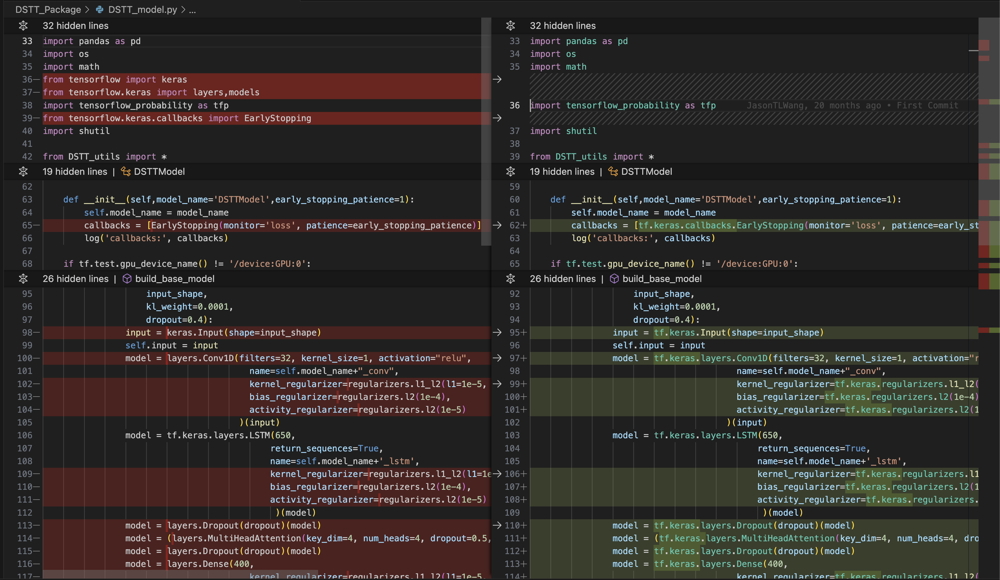
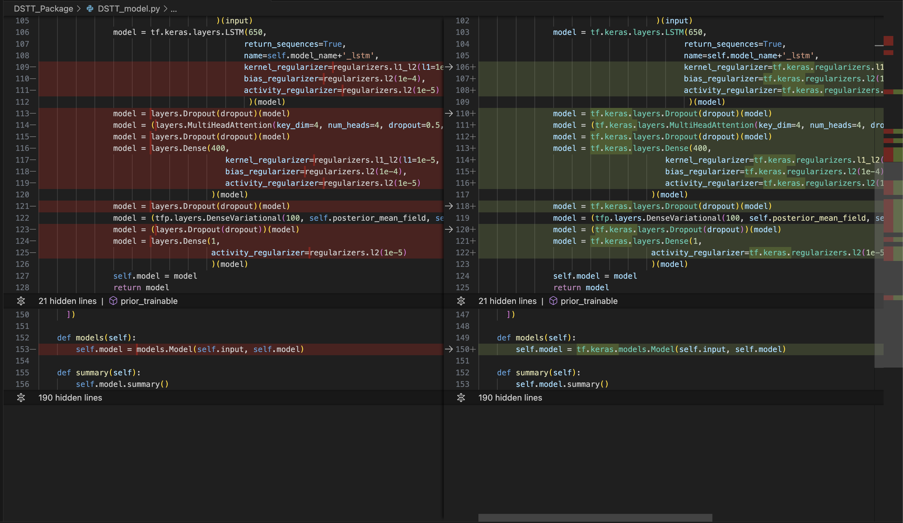
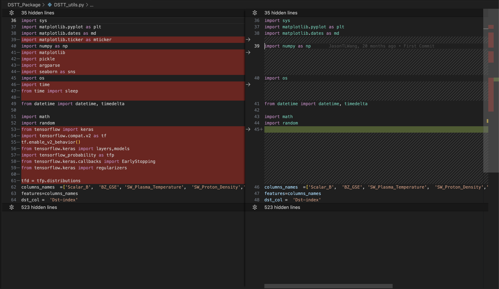

# CHANGELOG (3rd Feb 2024)

## System configuration

* Hardware - Apple M2 Pro Chip
* OS - MacOS 14.3
* Python version - v3.8.18
* Pip - v23.0.1

## Package Versions

1. tensorboard==2.13.0
2. tensorboard-data-server==0.7.2
3. tensorboard-plugin-wit==1.8.1
4. tensorflow==2.13.0
5. tensorflow-estimator==2.13.0
6. tensorflow-metal - Optional and only for Apple silicon
7. tensorflow-probability==0.20.1
8. numpy==1.24.3
9. pandas==1.3.4
10. keras==2.13.1
11. scikit-learn==1.3.2
12. matplotlib-inline==0.1.3
13. seaborn==0.11.2
14. scipy==1.10.1

## Code Change

The screenshots are git diff of the modified files. The **left section** in **red** is **old code** and **right section** in **green** is **new code**.

1. DSTT_model.py
    
    

2. DSTT_utils.py
    
